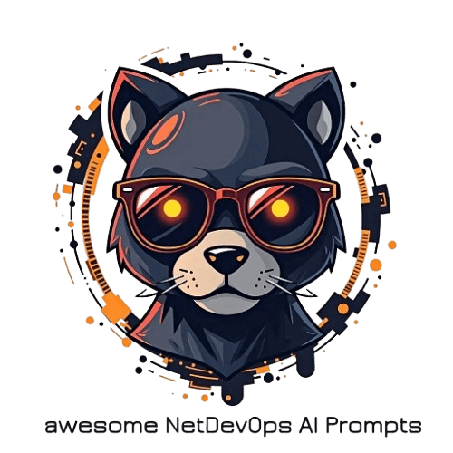

# Awesome NetDevOps AI Prompts

> Need help getting from NetDevOops to NetDevOps? Learn about how [Network Automation and NetDevOps at CACI](https://info.caci.co.uk/network-automation-devops-caci) can help you on your journey

 

## About
AI (Artificial Intelligence) is everywhere these days - in your Phone Apps, in your Social Media, in your NMS (AIOps anyone?)... and it's coming for NetDevOps and Network Engineering too!

This is a collection of AI (GPT, LLM, ML, RAG, NLP...) Prompts that are useful to Network Engineering, Network Architecture, Network Automation and NetDevOps (Network Development) usage.

## Prompts
### Example (Documentation)
* [Example Prompt](./prompts/example-docs/example-prompt.md) - Example of an prompt submission into this repo (use as template)

### Network Operations
* [Incident email to structured JSON](./prompts/network-operations/incident-email-to-structured-json.md)

### Network Engineering
* tbc

### NetDevOps
* tbc

## Contributing
Got a suggestion, useful Prompt or spotted an issue? We welcome contributions to this repo in the form of [Pull Requests](https://docs.github.com/en/pull-requests/collaborating-with-pull-requests/proposing-changes-to-your-work-with-pull-requests/creating-a-pull-request).

An example Prompt (to use as a template) can be found within the `/prompts/example-docs/` folder, simply:

1. Create a prompt using the applicable `.md` Markdown file structure within the `prompts/` folder
    * Use the [Example Prompt](./prompts/example-docs/example-prompt.md) as a template to copy-amend-paste from
    * Save this into a relevant existing subfolder of `prompts/` (such as `network-engineering/`), or create a new subfolder as a category if no suitable one already exists
    * Name the file with hyphenated lowercase spelling as a `.md` file, for example `prompt-about-thing.md` and save within this subfolder
2. Issue a Pull Request (PR) to update the [Prompts](#Prompts) section of this `README.md` file with a link to your new `prompt-file.md`
    * Use the link to the `Example Prompt` as an example to copy from
    * Ensure your new Prompt is under the correct category heading (such as [Network Engineering](#network-engineering)), or create new category heading if no suitable one already exists

## License
This project is licensed under the MIT License - see the [license](LICENSE) file for details.

## Support
If you find this useful, or are looking for help with your AIOps or Network Automation projects, [let's chat and see what we can do](https://info.caci.co.uk/contact-us-network-services) for your Enterprise, Data Centre, Service Provider or Cloud Network.

With over 20 year's experience as a trusted advisor in all things from [Network Engineering](https://www.caci.co.uk/services/network-infrastructure-consulting/), [Network Automation and NetDevOps](https://www.caci.co.uk/services/network-infrastructure-consulting/network-automation-and-netdevops/), [Delivery Assurance](https://www.caci.co.uk/services/network-infrastructure-consulting/delivery-assurance/), [Network Service Design](https://www.caci.co.uk/services/network-infrastructure-consulting/data-centre-solutions/) and ongoing [Managed Network Services](https://www.caci.co.uk/services/network-infrastructure-consulting/managed-network-services/), we're here for _your_ journey to Network Automation.